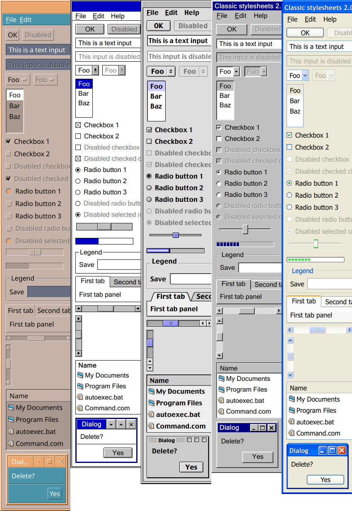

# Classic stylesheets for web applications.

5 themes and a combined 205 skins from Common Desktop Environment, Windows 3.x, Windows 9x/Me/2000, Windows XP, and Mac OS 9.

Demo:

* [Windows 3.1 / Windows 3.11](https://nielssp.github.io/classic-stylesheets/?theme=win3x&skin=3.1)
* [Windows 95](https://nielssp.github.io/classic-stylesheets/?theme=win9x&skin=95)
* [Windows 98](https://nielssp.github.io/classic-stylesheets/?theme=win9x&skin=98)
* [Windows 2000](https://nielssp.github.io/classic-stylesheets/?theme=win9x&skin=2000)
* [CDE (default)](https://nielssp.github.io/classic-stylesheets/?theme=cde&skin=default)
* [CDE (Solaris default)](https://nielssp.github.io/classic-stylesheets/?theme=cde&skin=crimson-4)
* [Windows XP Default blue (aka Luna)](https://nielssp.github.io/classic-stylesheets/?theme=winxp&skin=default)
* [Windows XP Olive green](https://nielssp.github.io/classic-stylesheets/?theme=winxp&skin=olive-green)
* [Windows XP Silver](https://nielssp.github.io/classic-stylesheets/?theme=winxp&skin=silver)
* [Mac OS 9](https://nielssp.github.io/classic-stylesheets/?theme=macos9&skin=default)

## Packages

Minified CSS files and assets can be downloaded from [the release page](https://github.com/nielssp/classic-stylesheets/releases/tag/v2.0).

Each theme package consists of the following:

* `theme.css` &ndash; The theme stylesheet
* `theme.min.css` &ndash; Minified version of the above file
* `layout.css` &ndash; Optional common layout utilities shared by all themes
* `layout.min.css` &ndash; Minified version of above file
* `combined.min.css` &ndash; Combination of `layout.min.css` and `theme.min.css`
* `skins/*.css` &ndash; Theme variations

## Modules

Most of the functionality works without JavaScript. Additional functionality can be enabled with the following minimal JavaScript modules found in the `modules` directory:

* [tabs.js](modules/tabs.js): Enables the use of tabs.
* [lists.js](modules/lists.js): Enables the use of list boxes.
* [wm.js](modules/wm.js): Experimental window manager, see [this demo](https://nielssp.github.io/classic-stylesheets/notepad.html).

